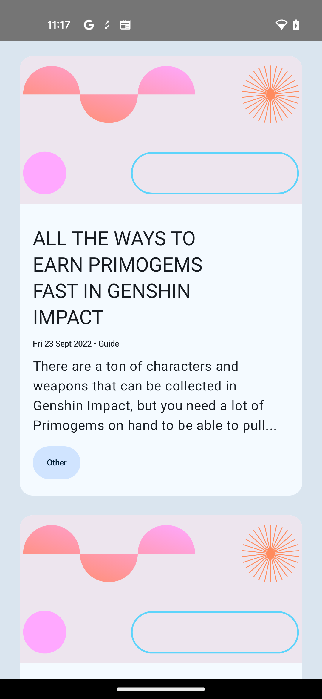
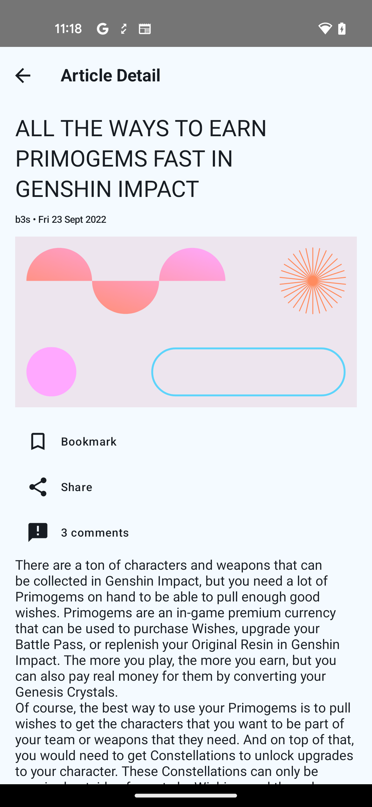
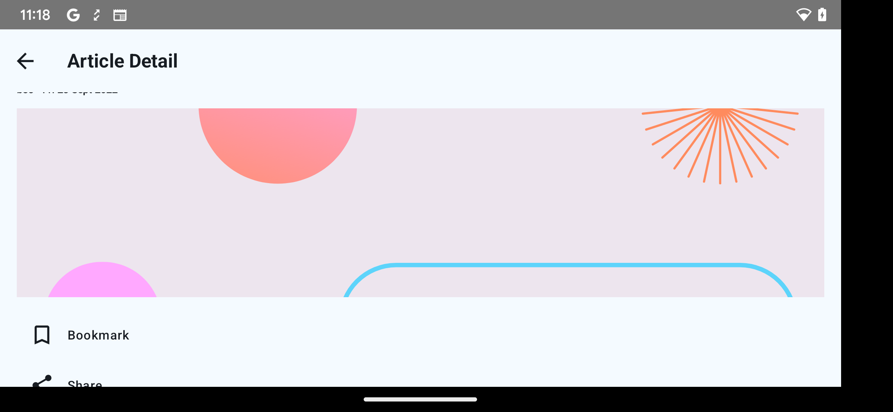

Articles is a comprehensive sample application designed to showcase best practices in Android app development, leveraging the power of the modern Android development stack. This project is built upon the principles of Clean Architecture, employing the Model-View-ViewModel (MVVM) pattern for a clear and maintainable codebase.

Key Technologies and Architectural Components:

1.  **Jetpack Compose:** The user interface is constructed using Jetpack Compose, the modern Android UI toolkit that simplifies and accelerates UI development with its declarative syntax. The project demonstrates the creation of dynamic and responsive UIs using Compose.

2.  **MVVM Architecture:** The application follows the MVVM architectural pattern, separating concerns into three layers: Model (data and business logic), View (UI), and ViewModel (connects the Model and View). This separation enhances code organization, testability, and maintainability.

3.  **Coroutines:** Asynchronous programming is handled using Kotlin Coroutines, allowing for efficient and non-blocking execution of tasks. This includes handling network requests, database operations, and other potentially time-consuming tasks in a responsive manner.

4.  **Flow:** The project integrates Kotlin Flow for handling reactive streams of data. This ensures a seamless and reactive data flow between the ViewModel and the UI, providing a concise and expressive way to handle asynchronous data updates.

5.  **Repository Pattern:** The project incorporates the Repository pattern to abstract the origin of data, whether it be from a local database or a remote server. This enhances the flexibility of data retrieval and management.

6.  **Dependency Injection:**  Hilt  is employed for dependency injection, promoting a modular and testable codebase. This ensures that components can be easily replaced or upgraded without affecting the entire system.

7.  **Unit Testing:** The project includes a comprehensive suite of unit tests to validate the correctness of individual components. This promotes a test-driven development (TDD) approach and ensures the robustness of the application.

8.  **Navigation** The Compose  Navigation  is used to handle navigation between different screens of the application, providing a structured and easy-to-maintain navigation.

By exploring and dissecting this project, developers can gain valuable insights into building scalable, maintainable, and performant Android applications using the latest tools and technologies available in the Android ecosystem.

## Features
- Article list - Responsive UI (1 item per row in portrait or when display width < 300.dp)
- Article Details - Responsive UI
- Pagination with Jetpack Pagination Library
- UI with Jetpack compose
- Image caching with Coil Image caching library
- Api Integration with retrofit
- Unit test with Mockito, Turbine and JUnit

## Architecture
The app follows multi modular MVVM with clean architecture (Data | Domain | Presentation)

#### Modules
##### Core
Contains core functionalities and core entity

##### Features
Contains features of the application. Ex. Articles.  Each feature module will contains Data, Domain and UI modules

## Screenshots

